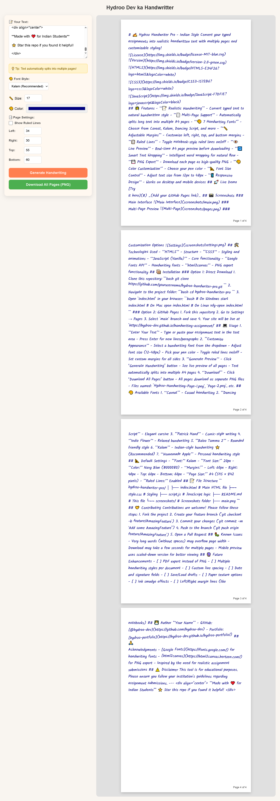
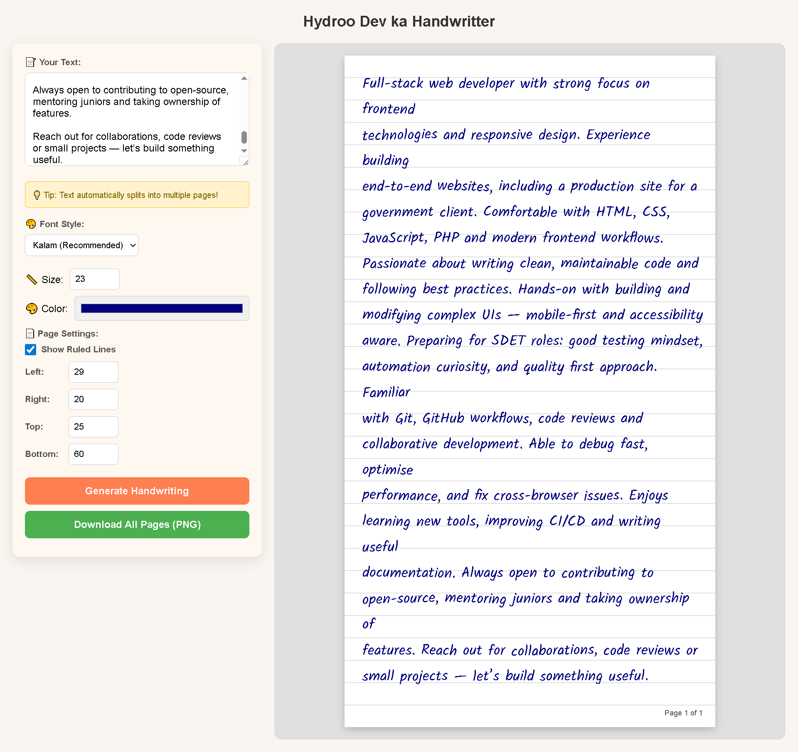

# ✍️ Hydroo Handwriter Pro - Indian Style

Convert your typed assignments into realistic handwritten text with multiple pages and customizable styling!


## 🌟 Features

- **📝 Realistic Handwriting** - Convert typed text to natural handwritten style
- **📄 Multi-Page Support** - Automatically splits long text into multiple A4 pages
- **🎨 7 Handwriting Fonts** - Choose from Caveat, Kalam, Dancing Script, and more
- **📏 Adjustable Margins** - Customize left, right, top, and bottom margins
- **📋 Ruled Lines** - Toggle notebook-style ruled lines on/off
- **👁️ Live Preview** - Real-time A4 page preview before downloading
- **🔄 Smart Text Wrapping** - Intelligent word wrapping for natural flow
- **💾 PNG Export** - Download each page as high-quality PNG
- **🎨 Color Customization** - Choose your pen color
- **📐 Font Size Control** - Adjust text size from 12px to 48px
- **📱 Responsive Design** - Works on desktop and mobile devices

## 🚀 Live Demo

[Try it here](#) _(Add your GitHub Pages link)_

## 📸 Screenshots

### Main Interface


### Multi-Page Preview



## 🛠️ Technologies Used

- **HTML5** - Structure
- **CSS3** - Styling and animations
- **JavaScript (Vanilla)** - Core functionality
- **Google Fonts API** - Handwriting fonts
- **html2canvas** - PNG export functionality

## 📦 Installation

### Option 1: Direct Download
1. Clone this repository:
```bash
git clone https://github.com/yourusername/hydroo-handwriter-pro.git
```

2. Navigate to the project folder:
```bash
cd hydroo-handwriter-pro
```

3. Open `index.html` in your browser:
```bash
# On Windows
start index.html

# On Mac
open index.html

# On Linux
xdg-open index.html
```

### Option 2: GitHub Pages
1. Fork this repository
2. Go to Settings → Pages
3. Select `main` branch and save
4. Your site will be live at `https://hydroo-dev.github.io/handwriting-assignment/`

## 💻 Usage

1. **Enter Your Text**
   - Type or paste your assignment text in the text area
   - Press Enter for new lines/paragraphs

2. **Customize Appearance**
   - Select a handwriting font from the dropdown
   - Adjust font size (12-48px)
   - Pick your pen color
   - Toggle ruled lines on/off
   - Set custom margins for all sides

3. **Generate Preview**
   - Click "Generate Handwriting" button
   - See live preview of all pages
   - Text automatically splits into multiple A4 pages

4. **Download**
   - Click "Download All Pages" button
   - All pages download as separate PNG files
   - Files named: `Hydroo-Handwriting-Page-1.png`, `Page-2.png`, etc.

## 🎨 Available Fonts

1. **Caveat** - Casual handwriting
2. **Dancing Script** - Elegant cursive
3. **Patrick Hand** - Comic-style writing
4. **Indie Flower** - Relaxed handwriting
5. **Baloo Tamma 2** - Rounded friendly style
6. **Kalam** - Indian-style handwriting ⭐ (Recommended)
7. **Homemade Apple** - Personal handwriting style

## 📐 Default Settings

- **Font:** Kalam
- **Font Size:** 20px
- **Color:** Navy Blue (#000080)
- **Margins:** 
  - Left: 60px
  - Right: 40px
  - Top: 60px
  - Bottom: 60px
- **Page Size:** A4 (595 × 842 pixels)
- **Ruled Lines:** Enabled

## 📝 File Structure

```
hydroo-handwriter-pro/
│
├── index.html          # Main HTML file
├── style.css           # Styling 
├── script.js           # JavaScript logic 
├── README.md           # This file
└── screenshots/        # Screenshots folder 
    ├── main.png
  
```

## 🤝 Contributing

Contributions are welcome! Please follow these steps:

1. Fork the project
2. Create your feature branch (`git checkout -b feature/AmazingFeature`)
3. Commit your changes (`git commit -m 'Add some AmazingFeature'`)
4. Push to the branch (`git push origin feature/AmazingFeature`)
5. Open a Pull Request

## 🐛 Known Issues

- Very long words (without spaces) may overflow page width
- Download may take a few seconds for multiple pages
- Mobile preview uses scaled-down version for better viewing

## 🔮 Future Enhancements

- [ ] PDF export instead of PNG
- [ ] Multiple handwriting styles per document
- [ ] Custom line spacing
- [ ] Date and signature fields
- [ ] Save/Load drafts
- [ ] Paper texture options
- [ ] Ink smudge effects
- [ ] Left/Right margin lines (like notebooks)


## 👨‍💻 Author

**Your Name**
- GitHub: [@hydroo-dev](https://github.com/hydroo-dev)
- Portfolio: [hydroo-portfolio](https://hydroo-dev.github.io/hydroo-portfolio/)

## 🙏 Acknowledgments

- [Google Fonts](https://fonts.google.com/) for handwriting fonts
- [html2canvas](https://html2canvas.hertzen.com/) for PNG export
- Inspired by the need for realistic assignment submissions

## ⚠️ Disclaimer

This tool is for educational purposes. Please ensure you follow your institution's guidelines regarding assignment submissions.

---

<div align="center">
  
**Made with ❤️ for Indian Students**

⭐ Star this repo if you found it helpful!

</div>